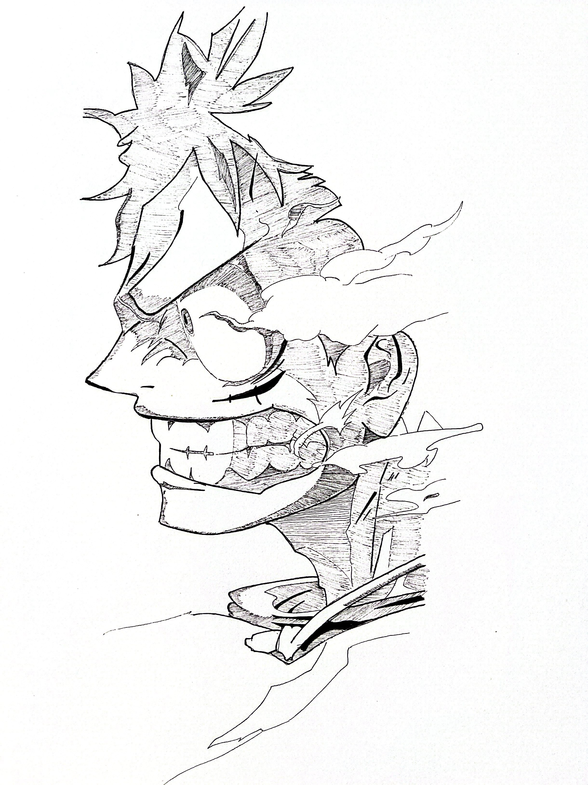

# Artwork Portfolio Journal 
# Name: Keith Anderson  
# Class: CS463

---

## Deployed Site

```text
http://127.0.0.1:5501/keithand.github.io/
```

## GitHub Repository

```text
https://github.com/Life1984/keithand.github.io/tree/main
```

## YouTube Code Walkthrough

```text
https://youtu.be/tJhGIhVkBfY
```

---

### Log Reports

## Log 1: Project Direction
I want the site to feel simple, clean, and focused on the images.

Used Courtney Poy's website as visual inspiration for the left-side 
name, vertical navigation, white space, and gallery layout.

I created a simple physical sketch of what I want the page layout
to look like. (BE SURE TO INCLUDE IN PRESENTATION).

---

## Log 2: File Structure
I plan to keep the project simple with three main files:

```text
index.html
styles.css
script.js
```

I also plan to use an `images/` folder for the artwork.

(Keeps the project easy to understand and easy to deploy with GitHub 
Pages).

---

## Log 3: Main Sections
I decided to make the website a single-page portfolio.

The main sections are:

```text
Work
About
Previous Work
Projects
Contact
```

Used JavaScript to switch between these sections instead of creating 
separate HTML pages.

---

## Log 4: Sidebar Navigation
Fixed sidebar on the left side of the page.

The sidebar includes my name:

```text
KEITH
ANDERSON
```

I added navigation text underneath the name.

The navbar is based on `04-navbar.html` 

Changed it from a horizontal navbar into a vertical menu.

---

## Log 5: Navigation Works Like Radio Buttons
I created hidden radio inputs and visible labels.

The labels are the text that the user clicks.

This gives me the selected-section behavior I want without showing 
normal radio buttons.

Example:

```html
<input type="radio" name="section" id="work-radio" checked />
<label for="work-radio" data-section="work">WORK</label>
```

---

## Log 6: Artwork Gallery
I created the Work section as an image gallery. 
(This connects to the layout idea from `01-grid.html`).

Instead of Bootstrap rows and columns, I used CSS Grid so the artwork 
can resize smoother.

---

## Log 7: Artwork Cards
I want my main home page to show all of my art in a 3x3 layout.
Each card should have an aspect ratio of: 16/10

I want the cards to "enlarge" when the user clicks on them, as they
will apear smaller at first. 

Placed each image inside an `article` element with the class `art-card`.
(This connects to the card idea from `06-cards.html`).

I keep the cards simple so the artwork stays more important than the container.
(NEED TO ADD IN THE TIME/DATE OF THE ART)

---

## Log 8: Image Hover Styling
I want the image card to have a drop shadow when the user's cursor is
hovering over each card.

https://prismic.io/blog/css-hover-effects -> Goes over varying styles 
(DID NOT END UP USING)

I added a light gray hover effect for each artwork card.
(MIGHT CHANGE COLOR OF DROP SHADOW. WHO KNOWS).

---

## Log 9: Lightbox Feature
I want the images to "fill the screen," when the user clicks on one.

"Lightbox" tutorial used: 
https://www.youtube.com/watch?v=uKVVSwXdLr0&t=63s

I added a lightbox so users can click an artwork image and see a 
larger version.

The lightbox can close in three ways:

```text
Click the close button
Click outside the image
Press Escape
```

(This is one of the custom JavaScript features I add beyond the basic class examples).

---

## Log 10: About Section
I created an "About" section with a short introduction about myself.
(UPDATE)

I described the site as a personal portfolio for artwork, technical 
projects, and "professional background".

---

## Log 11: Previous Work Section
I created a Previous Work section.

I included a short list of background items:

```text
Artwork and visual portfolio development
Web development coursework
Responsive layout and accessibility-focused design
Gallery design and category filtering
```

---

## Log 12: Projects Section
I created a Projects section with project cards.

Each card has:

```text
Project name
Short description
GitHub repository link
```

(This connects to the card structure from `06-cards.html`).
(REPLACE PLACEHOLDER LINKS WITH REAL ONES).

---

## Contact Section

I created a Contact section with a form.

The form includes:

```text
Name
Email
Message
Submit button
```

(The button connects to the button practice from `07-buttons.html`).
(GIVES A MESSAGE THAT I DONT HAVE THE NETWORKING SETUP YET TO SEND ME
EMAILS).

---

## Log 14: I add form validation
I used JavaScript to check the contact form.

The form checks for:

```text
Empty name field
Empty email field
Empty message field
Invalid email format
```

If something is missing, the page shows a message.
(THE FORM IS NOT CONNECTED TO A SERVER).

---

## Log 15: Organize the Artwork Images
I planed the image folder with these filenames:

```text
pen01.jpg
pen02.jpg
pen03.jpg
pen04.jpg
pen05.jpg
pen06.jpg
pen07.jpg
pen08.jpg
pen09.jpg
MS_Paint01.png
MS_Paint02.png
MS_Paint03.png
MS_Paint04.png
```

I need the filenames in the folder to match the filenames in `index.html`.
(Apperently GitHub Pages are case-sensitive).

---

## Log 16: Work Subcategories
I want the user to see a submenu below the "Works" section; showing the
multiple mediums that I use.

Video used for submenu: 
https://www.youtube.com/watch?v=3KVqLx6672o

I added a submenu under Work.

The submenu categories are:

```text
All
Pen/Pencil
Digital
Paint
```

The pen drawings go in the Pen/Pencil category.
The MS Paint drawings go in the Digital category.
The Paint category is included for future artwork.

(Just let the sub-catagories show without a drop-down).

---

## Log 17: Category Data for Each Artwork Card
I added `data-category` attributes to the artwork cards.

Pen and pencil drawings use:

```html
data-category="pen-pencil"
```

MS Paint drawings use:

```html
data-category="digital"
```

Future paintings can use:

```html
data-category="paint"
```

(This makes the gallery easier to filter within JavaScript).

---

## Log 18: Gallery Filtering
I wrote JavaScript that filters the gallery when the user clicks a category.

The filter behavior is:

```text
All shows every image
Pen/Pencil shows pen and pencil drawings
Digital shows MS Paint drawings
Paint shows paintings
```

(Since I don't have painting images yet, the Paint category shows a 
message saying no artwork has been added).

---

## Log 19: Local Testing
I plan to test the site locally with:

```bash
python3 -m http.server 8000
```

Then I open:

```text
http://localhost:8000
```

I test the gallery, filters, lightbox, form validation, and responsive layout.

Everything seems to check out, thus far.

---

## Log 20: Image Card Descriptions/Time 
I want to add titles to the image cards, along with assigning dates to them.
(I want to be sure to highlight that these are NOT my original creations - that
they are drawings from popular Manga/Anime).


DID NOT WORK:
```
<!-- Card02 -->
<article class="art-card" data-category="pen-pencil">
    

    <div class="art-info"
    <h3>Monkey D. Luffy - One Piece</h3>
    <p>Pen/Pencil, 2026</p>
    <p>A close-up drawing of "Luffy" from the renowed series - "One Piece" by: Eiichiro Oda</p>
    </div>
    </article>
```

'.art-info' was taking up normal page space. Needed to be absolutely positioned 
over the image and hidden until hover.

Filter buttons are now bricked?...

Somehow forgot to add closing '>' - bricked the gallery structure/filtering.

Added the following format to image cards:

```text
Name of Charact/Scene - Series 
Art Type - Date
Small Description of image/original creator 
```

---

## Log 21: Made Hidden Cards Actually Disappear
Ensures filtered-out cards are removed from the layout:

```
.art-card.is-hidden {
  display: none !important;
}
```

---

## Log 22: Refining my About Me Page
Looking over the current section, it lacks any artistic flaire, which sorta
defeats the purpose/overall theme I'm going for.

Used the following website for inspiration:
https://reallygooddesigns.com/about-me-website-examples/

Used two previous images of myself for the About Me page.

Added background shadow to both the secondary image of me, and to the text block.

---

## Log 23: Commented out "Previous Work" Label
Didn't serve a purpose. Will potentially make it work in the future.

---

## Log 24: Updated my Previous "Projects" Tab
Added proper links to my CS496 and 491 GitLab repos.

---

## Log 25: Updated "Paint" Sub-Group
I want to add in an image/text to make the "Paint" section less plain.

Added in a quick sketch/text to highlight that there is no present content.

I added a custom Paint placeholder card so the Paint submenu no longer feels 
empty. Instead of showing only a plain “Under Construction” message, the Paint 
category now displays a full work-in-progress layout with text and a drawing.

I also made the Paint card different from the normal gallery cards. Normal 
artwork thumbnails use a fixed wide crop, but the Paint drawing is tall, so I 
added custom CSS that overrides the default image crop:

```
aspect-ratio: auto;
object-fit: contain;
```
That lets the full drawing appear without being cut off.

---

## Log 26: Updated Paint Logic
Added a special case so that the user will only see the Paint work-in-progress 
placeholder, as opposed to seeing it in the "All" catagory.

---

## Log 27: Removed Previous Work Sub-Menu
I decided to remove the "Previous Work" sub-menu, as the whole point of the site
is to show-off my previous art.

---

### Sources Used for Project:
webdev-lab-notebook - Public Repo on GitHub
By: caterinasworld - Caterina 
https://github.com/caterinasworld/webdev-lab-notebook/tree/main

"24 Eye-Catching About Me Website Examples"
By: Denitsa Zhelyazkova
https://reallygooddesigns.com/about-me-website-examples/

"CSS Hover Effects: 40 Engaging Animations To Try"
By: Nefe Emadamerho-Atori
https://prismic.io/blog/css-hover-effects

"Build a Dropdown Submenu with HTML and CSS"
By: Treehouse
https://www.youtube.com/watch?v=3KVqLx6672o

"Simple Image Lightbox Tutorial"
By: Web Dev Simplified
https://www.youtube.com/watch?v=uKVVSwXdLr0&t=63s

---
